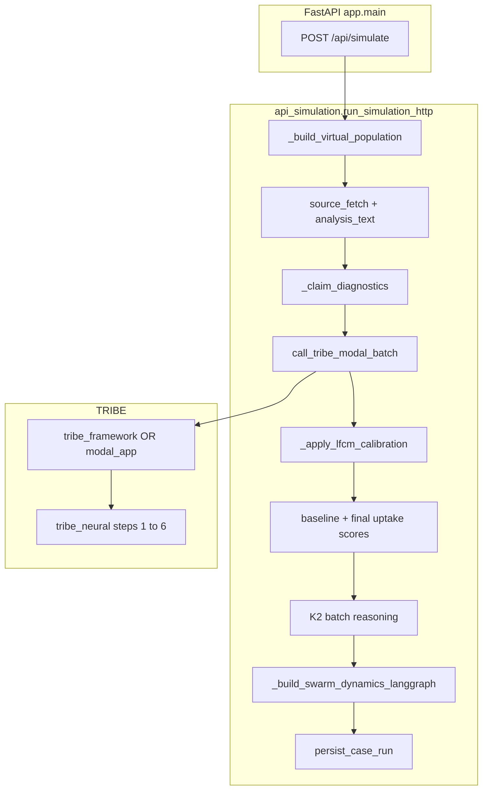

# Cortexia

Predictive **information epidemiology** workspace: stress-test a catalyst (message + evidence) against a **synthetic, geo-mapped population**, combining **TRIBE-style neural readouts** (BSV), **K2 reasoning**, and a **multi-round propagation** model.


---

## Repository layout

| Path | Role |
|------|------|
| **`frontend/`** | Vite + React + TypeScript (Mapbox, Deck.gl, Recharts). Dev server proxies `/api` → backend. |
| **`backend/`** | FastAPI orchestrator, SQLite persistence, simulation + AI clients (see **Backend pipeline** below). |
| **`backend/tribe_neural/`** | Vendored **6-step TRIBE pipeline** (model → ROI timeseries → stats → connectivity → composites → format). |
| **`backend/modal_app.py`** | Optional **Modal** deployment for remote TRIBE batch extraction (`TRIBE_RUNTIME_MODE=modal`). |

Do not commit real `.env` files; use `*.env.example` as templates (`.env` is gitignored).

---

## Backend pipeline (specific)

### Package map

| File / directory | Responsibility |
|------------------|----------------|
| **`app/main.py`** | FastAPI app, lifespan (`init_pipeline_store`, `init_population_store`), routes: `/api/simulate`, `/api/transcribe`, runs CRUD, populations, agent conversation + TTS, Action Center, static audio. |
| **`app/config.py`** | `pydantic-settings`: `TRIBE_RUNTIME_MODE`, HF/Modal/K2/ElevenLabs/Tavily/Firecrawl keys, simulation timeouts (`simulate_*`), `simulate_population_size`, `pipeline_db_path`, CORS. |
| **`app/pipeline_store.py`** | SQLite: `case_runs`, `agent_outcomes`, `agent_conversations`, `simulation_rounds`; `persist_case_run`, fetch/list helpers. |
| **`app/population_store.py`** | SQLite: `agents` per `city_id`; `fetch_population`, `save_population`, `list_population`. |
| **`app/city_presets.py`** | Geographic zones / labels for `city_id`. |
| **`app/services/api_simulation.py`** | **`run_simulation_http`**: full case pipeline (evidence → TRIBE → calibration → scores → K2 → LangGraph swarm → payload). Population: **`_build_virtual_population`**, **`_generate_demographics`**, **`_ensure_population_education_mix`**. Uptake: **`_claim_diagnostics`**, **`_baseline_uptake_score`**, **`_final_uptake_score`**, **`_state_from_context`**. Swarm: **`_HeuristicLangGraphDecisionEngine`**, **`_build_swarm_dynamics_langgraph`** (hybrid LLM + heuristic, **`run_simulation_loop`**, then score replay into **`per_agent_history`**; final **`belief_state`** from last round). |
| **`app/services/ai_clients.py`** | **`call_tribe_modal_batch`** (framework vs Modal), **`call_k2_batch_think`**, **`call_k2_explanation_only`**, **`call_k2_timeline_batch`**, **`call_k2_agent_conversation`**, ElevenLabs STT/TTS. |
| **`app/services/tribe_framework.py`** | **Framework TRIBE**: `run_framework_batch` → `_pipeline_once` (`tribe_neural` steps) → per-agent **`_modulate_roi_stats`** + **`compute_composites`** + **`_derive_bsv`**; **`tribe_meta.per_agent`** (composites, `dominant_roi`, `signal_confidence`). |
| **`app/services/langgraph_multi_agent_sim.py`** | **`run_simulation_loop`**, `StateGraph`, **`HybridLangGraphDecisionEngine`**, **`make_chat_openai_decision_engine`**. |
| **`app/services/action_center.py`** | Live research dossier (Tavily/Firecrawl) for Action Center routes. |

### `POST /api/simulate` — execution order

All logic is driven from **`run_simulation_http`** in **`app/services/api_simulation.py`**, with wall-clock stages recorded in **`stage_trace`** on the response.

1. **Population** — **`_build_virtual_population(city_id, simulate_population_size)`**: load agents from **`population_store`** or synthesize new rows (demographics from **`_generate_demographics`**, education floor via **`_ensure_population_education_mix`**), persist with **`save_population`** when new agents are created.

2. **`source_fetch`** — **`_fetch_source_context`**: optional HTML/text excerpt from `evidence.source_url` (timeout **`simulate_source_fetch_timeout_seconds`**).

3. **Text assembly** — **`_build_analysis_text`**: canonical analysis string (edited/transcript/text + optional excerpt + speaker context).

4. **Feature + claim vectors** — **`_case_feature_vector`**, **`_claim_diagnostics`**: global **credibility / harm / virality** (same for all agents this run).

5. **`tribe_batch`** — **`call_tribe_modal_batch`** in **`ai_clients.py`**:
   - **`TRIBE_RUNTIME_MODE=framework`**: **`run_framework_batch`** — one **`run_tribe`** forward pass, then per-agent ROI modulation + composite recompute + BSV; returns **`tribe_meta`** with baseline **`roi_stats` / `composites`** and **`per_agent`**.
   - **`modal`**: HTTP POST to **`TRIBE_MODAL_URL`** (`modal_app.py` mirrors the same math).

6. **TRIBE metadata** — **`_augment_tribe_meta`**: `surface_summary`, ROI rankings, composite highlights, **`per_agent_count`** / note when **`per_agent`** exists.

7. **Per-agent composite biases** — **`_agent_composite_biases(agent_id)`**: reads **`tribe_meta.per_agent[id].composites`** when present; else stimulus-level composites. Used when adjusting **baseline** and **final** uptake scores.

8. **LFCM calibration** — **`_apply_lfcm_calibration`**: maps raw TRIBE BSV through role/geo/demographic **`_agent_conditioning`** + case features.

9. **Traits + conditioning** — **`_agent_traits`**, **`_agent_conditioning`**: evidence literacy, peer susceptibility, scrutiny, etc., from demographics + role.

10. **Baseline uptake** — **`_baseline_uptake_score`** per agent, then add **herding / approach / regulation / reactivity** terms from **`_agent_composite_biases`**.

11. **Spatial layer** — **`_neighbor_context`**, **`_apply_spatial_bsv`**, **`local_adoption_ratio`**, **`_final_uptake_score`** + same composite bias terms; **`_derive_brain_regions`**, dominant **signal** from **`_signal_scores`**.

12. **K2 reasoning (optional)** — If K2 URL/key set: **`call_k2_batch_think`** / explanation path with concurrency **`simulate_k2_concurrency`**; otherwise fallback reasoning payloads. **`_materialize_agent_result`** builds each agent dict with **`_pipeline`** for the swarm.

13. **Swarm** — **`_build_swarm_dynamics_langgraph`**: builds **`graph_agents`** from agents + network edges, runs **`run_simulation_loop`** (LangGraph + hybrid LLM/heuristic engine), then **replays ticks** into **`per_agent_history`** (scores, **`_state_from_context`**, round posts, support/pushback **shares** + **influence** fields). **Final `belief_state`** on each agent is **overwritten** from the **last** history row.

14. **Timeline language (optional)** — **`_render_timeline_language`** → **`call_k2_timeline_batch`** when time budget allows.

15. **`persist_run`** — **`persist_case_run`** in **`pipeline_store`**: `case_runs` row, `agent_outcomes`, `simulation_rounds`; returns **`run_id`**.

16. **Response** — Workspace payload + **`tribe_meta`**, **`stage_trace`**, **`effective_catalyst_text`**, etc.

### Neural submodule (`tribe_neural/`)

Executable sequence (see also **`tribe_neural/pipeline.py`**):

| Step | Module | Output |
|------|--------|--------|
| 1 | `steps/step1_tribe.py` — `run_tribe` | Cortical prediction tensor |
| 2 | `steps/step2_roi.py` — `extract_all` | Per-ROI timeseries |
| 3 | `steps/step3_stats.py` — `extract_stats` | 11 stats per ROI |
| 4 | `steps/step4_connectivity.py` — `compute_connectivity` | Pairwise **r** / **p** |
| 5 | `steps/step5_composites.py` — `compute_composites` | 8 composite scores |
| 6 | `steps/step6_format.py` — `format_output` | Narrative string |

### SQLite (default **`backend/cortexia.db`**)

- **`case_runs`**: full JSON response, analysis text, claim diagnostics, fidelity.  
- **`agent_outcomes`**: per-run agent snapshot (tribe, calibrated BSV, traits, scores, outcome).  
- **`agent_conversations`**: user ↔ agent chat turns + optional audio filename.  
- **`simulation_rounds`**: round-level adoption/rejection rates and posts.  
- **`agents`** (`population_store`): durable synthetic people per **`city_id`**.

### End-to-end diagram



---

## API surface (selected)

| Method | Path | Purpose |
|--------|------|---------|
| POST | `/api/simulate` | Full case run (evidence, `city_id`, `domain`, `case_goal`, `message_complexity`). |
| POST | `/api/transcribe` | ElevenLabs STT for audio evidence. |
| GET | `/api/runs/recent`, `/api/runs/{id}` | Persisted runs. |
| GET/PUT | `/api/runs/.../agents/...` | Agent outcome, notes, conversation. |
| GET | `/api/populations/{city_id}/agents` | City synthetic population listing. |
| GET | `/api/action-center/status` | Live research provider config. |
| POST | `/api/action-center/research` | Tavily/Firecrawl-backed research dossier. |
| GET | `/api/audio/{filename}` | Served TTS replies from agent chat. |

---

## Configuration

Copy **`backend/.env.example`** → **`backend/.env`**:

- **`TRIBE_RUNTIME_MODE`** — `framework` or `modal`.  
- **`HF_TOKEN`** — required for **framework** mode.  
- **`TRIBE_MODAL_URL`** (+ optional Modal headers) — **modal** mode.  
- **`IFM_API_KEY` / `K2_THINK_API_KEY`** — K2 Think.  
- **`simulate_population_size`**, **`simulate_total_timeout_seconds`**, etc. — see **`app/config.py`**.

Frontend: **`frontend/.env`** — `VITE_MAPBOX_TOKEN`, `VITE_API_BASE_URL`.

---

## Local development

**Backend**

```bash
cd backend
python3 -m venv .venv && source .venv/bin/activate
pip install -r requirements.txt
# Framework mode: backend/scripts/setup_tribe_framework.sh
uvicorn app.main:app --reload --port 8000
```

**Frontend**

```bash
cd frontend && npm install && npm run dev
```

Open **http://127.0.0.1:5173/** (prefer `127.0.0.1` if `localhost` binds IPv6 oddly).

**Modal TRIBE**

```bash
cd backend && modal deploy modal_app.py
```

Set `TRIBE_MODAL_URL` when using `TRIBE_RUNTIME_MODE=modal`.

---

## Frontend (summary)

- **`SimulationDashboard`** — primary case flow.  
- **`MapView` / `BrainViz` / `AgentInspectionModal`** — map colors from post-swarm **`belief_state`**; inspector shows demographics and TRIBE/K2 fields.  
- **`frontend/src/lib/api/simulate.ts`**, **`store/cortex.ts`** — API and client state.
