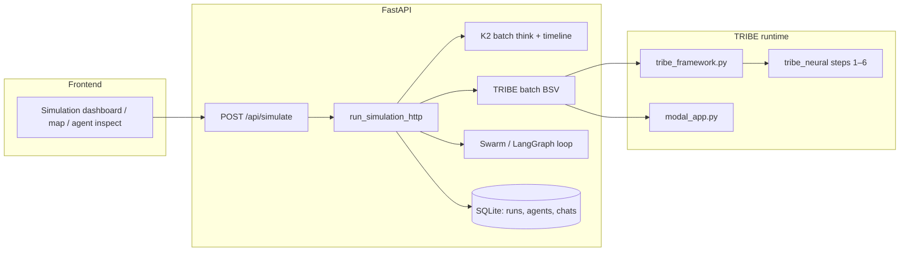

# Cortexia Compass

Predictive **information epidemiology** workspace: stress-test a catalyst (message + evidence) against a **synthetic, geo-mapped population**, combining **TRIBE-style neural readouts** (BSV), **K2 reasoning**, and a **multi-round propagation** model.

**Product and architecture reference:** [`docs/CORTEXIA_BLUEPRINT.md`](docs/CORTEXIA_BLUEPRINT.md).

---

## Repository layout

| Path | Role |
|------|------|
| **`frontend/`** | Vite + React + TypeScript (Mapbox, Deck.gl, Recharts). Dev server proxies `/api` → backend. |
| **`backend/`** | FastAPI orchestrator, SQLite persistence (`pipeline_store`, `population_store`), simulation + AI clients. |
| **`backend/tribe_neural/`** | Vendored **6-step TRIBE pipeline** (model forward pass → ROI timeseries → stats → connectivity → composites → formatted narrative). |
| **`backend/modal_app.py`** | Optional **Modal** deployment for remote TRIBE batch extraction (`TRIBE_RUNTIME_MODE=modal`). |

Do not commit real `.env` files; use `*.env.example` as templates (`.env` is gitignored).

---

## Pipeline architecture (end-to-end)



### 1. Neural layer (`tribe_neural` + adapters)

Single **stimulus** forward pass per case:

1. **Step 1** — `run_tribe`: TRIBE v2 predictions over Schaefer-parcellated cortex.  
2. **Step 2** — `extract_all`: ROI timeseries (fear/salience, reward, deliberation, social, motor, attention).  
3. **Step 3** — `extract_stats`: per-ROI features (peak, AUC, trajectory, CV, …).  
4. **Step 4** — `compute_connectivity`: pairwise correlations between ROI pairs.  
5. **Step 5** — `compute_composites`: eight composite scores (arousal, valence, dominance, …).  
6. **Step 6** — `format_output`: human/LLM-readable block.

**Runtime selection** (`TRIBE_RUNTIME_MODE` in `backend/.env`):

- **`framework` (default)** — Runs `tribe_neural` **in-process** via `app/services/tribe_framework.py`. Requires `HF_TOKEN` and local `tribe_data` resources.  
  - **Personalization:** baseline `roi_stats` / `composites` describe the **shared stimulus**. For each agent, stats are **deep-copied and amplitude-scaled** from **demographics + role**, then **composites are recomputed** and **BSV** is derived. `tribe_meta.per_agent` holds per-agent composites (used for uptake **herding / approach / regulation / reactivity** biases).  
- **`modal`** — `call_tribe_modal_batch` POSTs to `TRIBE_MODAL_URL`; personalization follows whatever the deployed `modal_app.py` returns (global `tribe_meta` composites unless the endpoint adds per-agent fields).

### 2. Simulation orchestration (`api_simulation.py`)

`run_simulation_http` roughly:

- Fetch optional **source excerpt** from `source_url`.  
- Build **analysis text** from evidence + transcript + excerpt.  
- **TRIBE batch** with agents that include **id, role, lat/lng, demographics**.  
- **LFCM-style calibration** of BSV per agent (city, traits, case features).  
- **Baseline / final uptake scores** with **per-agent composite biases** when `tribe_meta.per_agent` is present (framework mode).  
- **K2** batch for reasoning traces; optional **timeline language** for rounds.  
- **Swarm dynamics** (multi-round posts, neighborhood influence). Round history exposes **support/pushback shares** (0–1) aligned with narrative text, plus raw **influence** totals where needed.  
- Persist run + agent rows to SQLite.

### 3. Frontend

- **`SimulationDashboard`** — primary case flow.  
- **`MapView` / `BrainViz` / `AgentInspectionModal`** — geography + neural visualization + K2 trace + round history.  
- **`frontend/src/lib/api/simulate.ts`** + **`store/cortex.ts`** — API integration and client state.

---

## API surface (selected)

| Method | Path | Purpose |
|--------|------|---------|
| POST | `/api/simulate` | Full case run (evidence, `city_id`, `domain`, `case_goal`, `message_complexity`). |
| POST | `/api/transcribe` | ElevenLabs STT for audio evidence. |
| GET | `/api/runs/recent`, `/api/runs/{id}` | Persisted runs. |
| GET/PUT | `/api/runs/.../agents/...` | Agent outcome, notes, conversation. |
| GET | `/api/populations/{city_id}/agents` | City synthetic population listing. |
| GET | `/api/action-center/status` | Live research provider config. |
| POST | `/api/action-center/research` | Tavily/Firecrawl-backed research dossier. |

---

## Configuration

Copy **`backend/.env.example`** → **`backend/.env`** and set at minimum:

- **`TRIBE_RUNTIME_MODE`** — `framework` or `modal`.  
- **`HF_TOKEN`** — required for **framework** mode.  
- **`TRIBE_MODAL_URL`** (and optional Modal auth headers) — for **modal** mode.  
- **`IFM_API_KEY` / `K2_THINK_API_KEY`** — K2 Think (optional empty uses mock path where implemented).

Frontend: **`frontend/.env`** — `VITE_MAPBOX_TOKEN`, `VITE_API_BASE_URL` (e.g. `http://127.0.0.1:8000`).

---

## Local development

**Backend**

```bash
cd backend
python3 -m venv .venv && source .venv/bin/activate
pip install -r requirements.txt
# Framework mode: run backend/scripts/setup_tribe_framework.sh if you have not pulled tribe resources.
uvicorn app.main:app --reload --port 8000
```

**Frontend**

```bash
cd frontend && npm install && npm run dev
```

Open **http://127.0.0.1:5173/** (if `localhost` misbinds on IPv6, use `127.0.0.1`).

**Modal TRIBE** (optional)

```bash
cd backend && modal deploy modal_app.py
```

Set `TRIBE_MODAL_URL` to the deployed HTTPS endpoint when using `TRIBE_RUNTIME_MODE=modal`.
